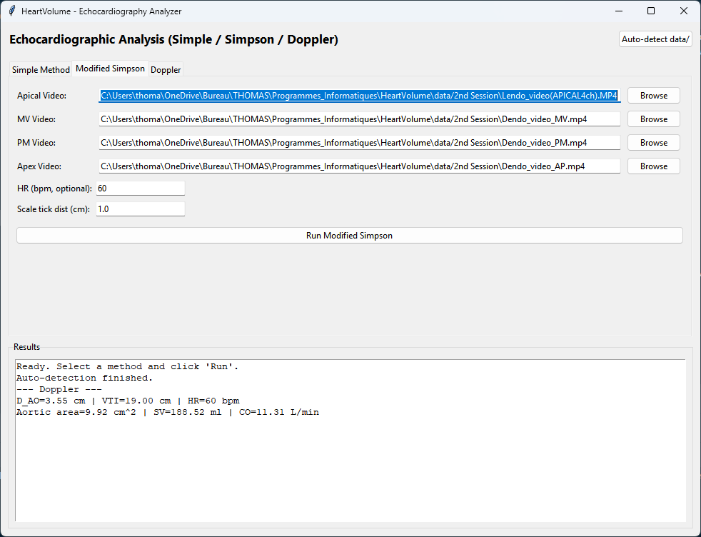
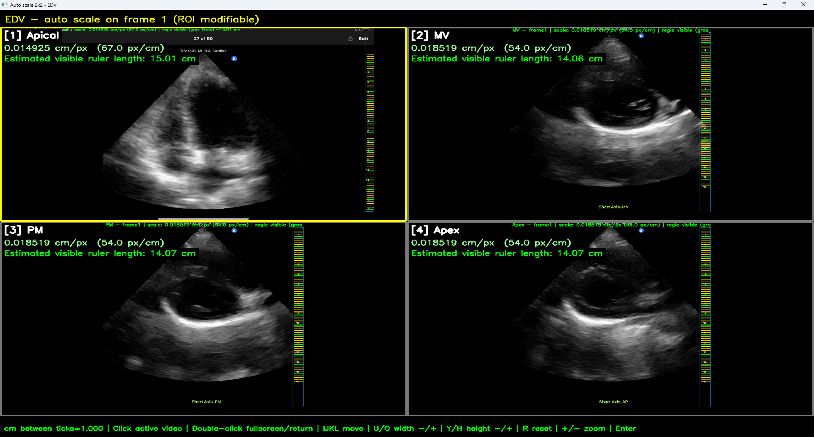
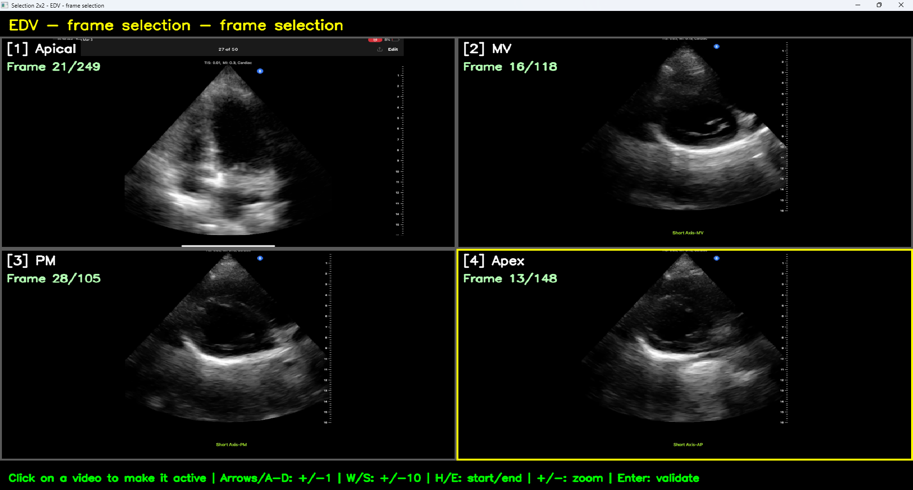
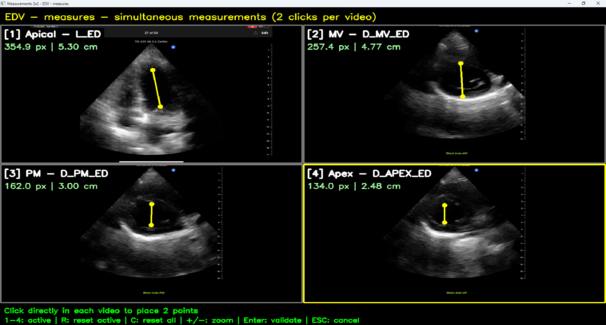
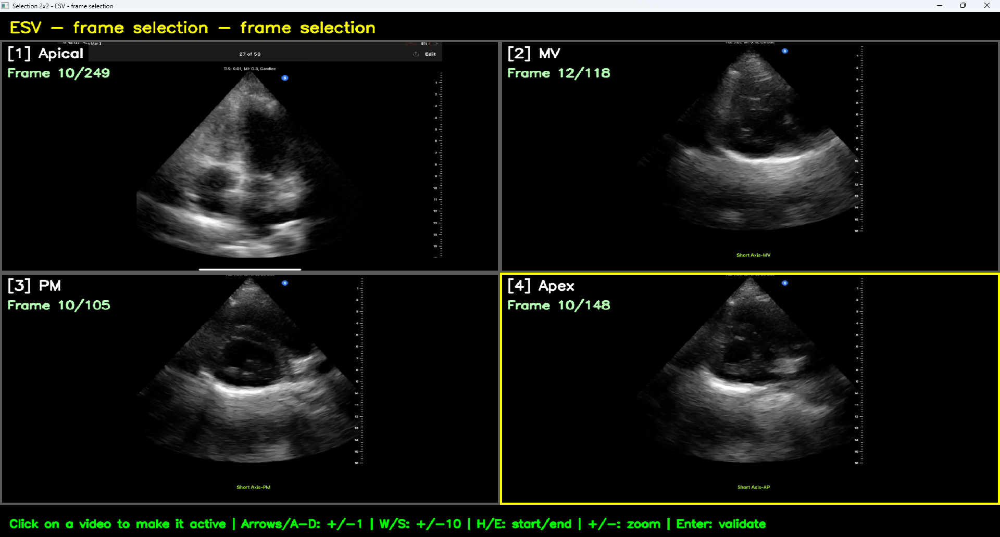
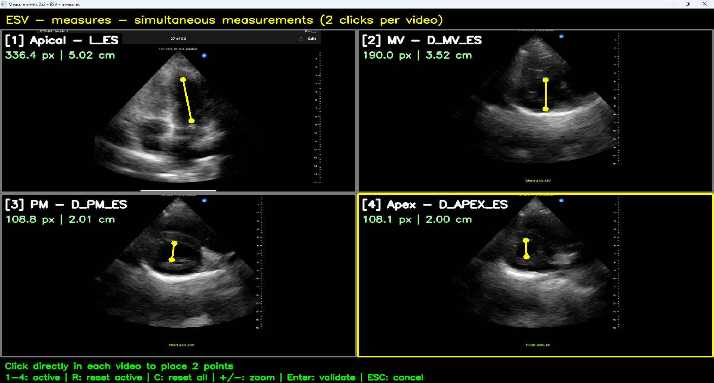
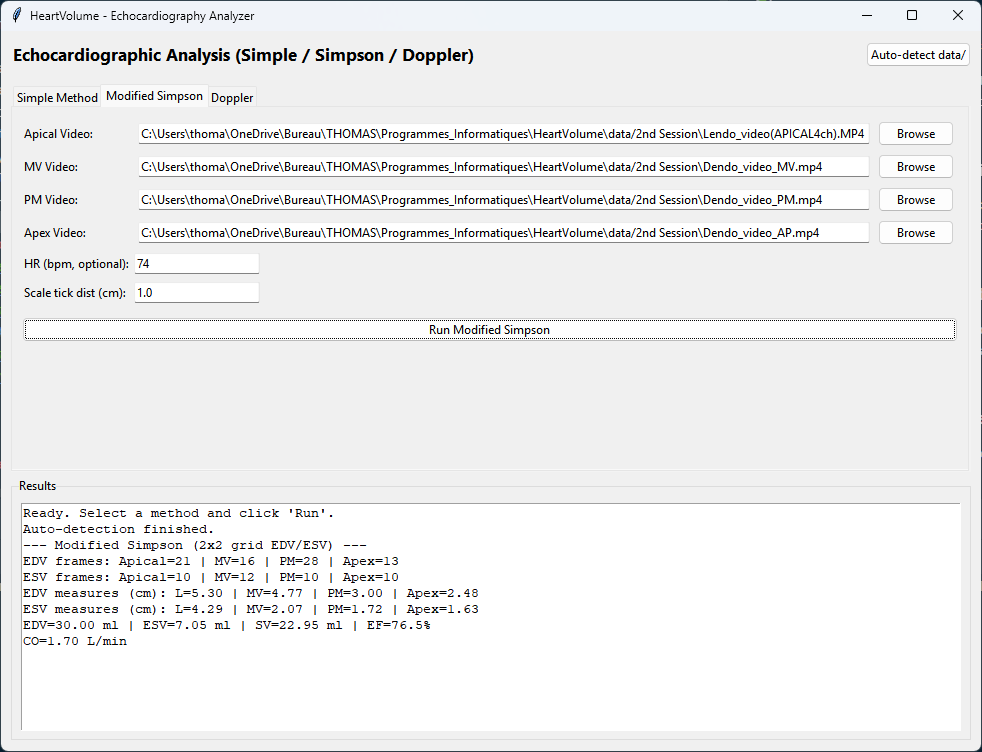

# HeartVolume - Echocardiography Volume Analyzer

HeartVolume is a desktop Python app (Tkinter + OpenCV) to estimate cardiac volumes from echocardiography videos using three workflows: Simple method, Modified Simpson method, and Doppler method.

A practical GUI tool for semi-automatic echo analysis:
- frame selection on videos,
- automatic scale detection on the right ruler,
- interactive length/diameter measurements,
- EDV/ESV/SV/EF computation,
- optional cardiac output estimation from HR,
- Doppler-based stroke volume and CO estimation.

## Table of Contents
- [Main features](#main-features)
- [Quick start](#quick-start)
- [Project structure](#project-structure)
- [Data](#data)
- [Using the Modified Simpson Workflow](#using-the-modified-simpson-workflow)
- [Experimental Features: Automatic Ellipse Tracking](#experimental-features-automatic-ellipse-tracking)

---

## Main features

- **Simple method**: Lendo/Dendo ED+ES measurements from an apical video.
- **Modified Simpson method**: synchronized 2x2 workflow on 4 videos (Apical, MV, PM, Apex).
- **Doppler method**: D_AO + VTI + HR based output.
- **Scale detection**:
  - right-side fixed ROI logic,
  - rising-front detection on right-edge pixel profile,
  - deterministic major ticks (every 5 minor ticks),
  - manual ROI adjustment and visual overlay.

## Quick start

```bash
python main.py
```

If your environment requires dependencies, install at least:

```bash
pip install -r requirements.txt
```

## Project structure

- `main.py`: GUI entrypoint.
- `heartvolume/gui/app.py`: Tkinter application and workflows.
- `heartvolume/imaging/scale_detection.py`: scale detection pipeline.
- `heartvolume/imaging/video_tools.py`: frame selection and 2x2 interactive tools.
- `heartvolume/imaging/automaticTracking/`: Experimental scripts for ellipse fitting/tracking.
- `heartvolume/core/calculations.py`: volume and Doppler formulas.
- `heartvolume/data/discovery.py`: auto-discovery of data files.

## Data

By default, the app tries to auto-detect files in the `data/2nd Session` folder (Lendo, Dendo MV/PM/AP, D_AO).

---

## Using the Modified Simpson Workflow

The Modified Simpson method allows you to synchronize the analysis of 4 different videos (Apical, MV, PM, Apex). Here is a step-by-step guide on how to use this feature through the GUI.

### 1. Launching and Auto-Detection
Start the app. In the "Modified Simpson" tab, you can click the "Auto-detect data/" button to automatically fill the video paths if they are located in your `data/2nd Session/` folder. Alternatively, you can browse for each video manually. Click **Run Modified Simpson** when ready.
<br>


### 2. EDV Phase: Automatic Scale Detection
The app will open a 2x2 grid to automatically detect the cm/pixel scale on the first frame of each video. It looks for the ruler on the right edge. If a detection fails, you can manually adjust the Region of Interest (ROI) using the keyboard. Press **Enter** to validate.
<br>


### 3. EDV Phase: Frame Selection
Next, you must select the End-Diastolic (EDV) frame for each video. Click on a panel to make it active, then use the arrow keys to navigate the timeline. Press **Enter** when you have found the optimal frame for all 4 videos.
<br>


### 4. EDV Phase: Measurements
You are now prompted to measure specific distances (L_ED, D_MV_ED, D_PM_ED, D_APEX_ED). Click twice on each video to draw a measurement line. The distance in cm is calculated automatically based on the scale detected earlier. Press **Enter** to validate.
<br>


### 5. ESV Phase (Scale, Frames, Measurements)
The exact same three steps (Scale validation, Frame Selection, and Measurement) will repeat, but this time you need to target the End-Systolic (ESV) phase.
<br>

<br>


### 6. Final Results
Once all measurements are done, the window closes and the main GUI text box will display the summary of your measurements along with the final computed End-Diastolic Volume (EDV), End-Systolic Volume (ESV), Stroke Volume (SV), Ejection Fraction (EF), and Cardiac Output (CO).
<br>


---

## Experimental Features: Automatic Ellipse Tracking

This project also includes experimental scripts intended to automatically track an ellipse across ultrasound video frames. This feature is located in the `heartvolume/imaging/automaticTracking/` folder.

> ⚠️ **DISCLAIMER:** This feature is **highly experimental** and **does not work very well**. Tracking the endocardium border on noisy ultrasound footage is a complex computer vision task. The current scripts are a proof-of-concept.

I have explored several techniques to tackle this issue, though none have yielded perfect results yet. Below are some examples of the attempts:

1. **Approach 1: Threshold-based Region Growing & Ellipse Fitting**
   *(Implemented in `automaticTracking/`)*
   This approach relies on classical computer vision. The user draws an initial manual trace on the first frame. Then, a region-growing algorithm expands this seed mask using morphological dilation. It looks at the difference in brightness (percentile-based) between the inner region and an outer ring to find a "global transition" that represents the endocardium wall. Once it hits a user-defined threshold, it stops growing and fits an ellipse to the resulting contour. For subsequent frames, the ellipse from the previous frame is used as the seed. It works somewhat on high-contrast videos but struggles heavily with noise and dropouts typical of ultrasound imagery.
   <br>
   
   <br>
   

2. **Approach 2: Optical Flow (Lucas-Kanade)**
   An attempt was made using the Lucas-Kanade optical flow method. The idea was to identify "good features to track" (using `cv2.goodFeaturesToTrack`) along the contour of the manually drawn ellipse on the first frame, and then calculate their displacement frame by frame using `cv2.calcOpticalFlowPyrLK`. While optical flow is standard for motion tracking, it fails rapidly on echocardiograms because the tissue appears and disappears (speckle noise decorrelation), meaning the tracked points quickly drift away from the actual anatomical border.
   <br>
   

3. **Approach 3: Deep Learning (EchoNet-Dynamic)**
   I also looked into state-of-the-art AI solutions, specifically the **[EchoNet-Dynamic](https://github.com/echonet/dynamic)** model developed by Stanford. It uses a deep learning segmentation architecture specifically trained on thousands of apical 4-chamber echocardiography videos to automatically segment the left ventricle. Surprisingly it's the least conclusive approach. But I have to say the lendo videos are very low quality.
   <br>
   
